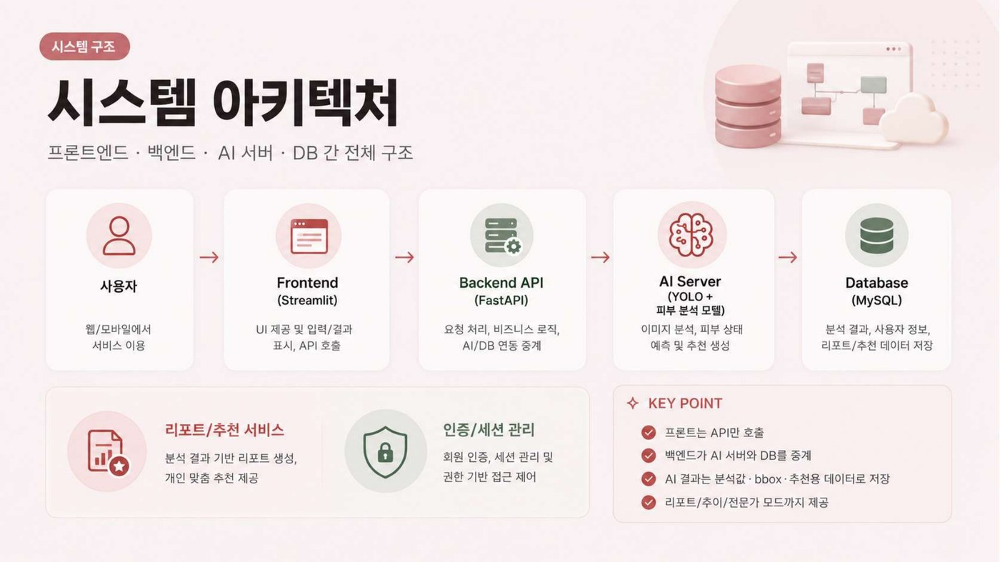
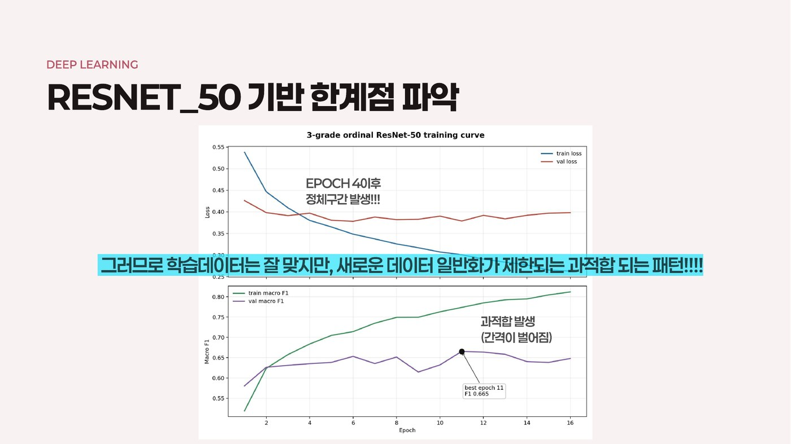
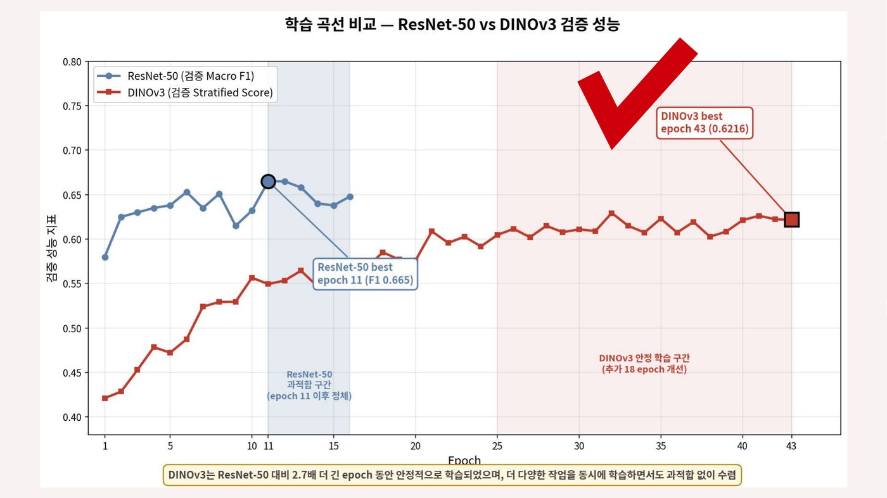
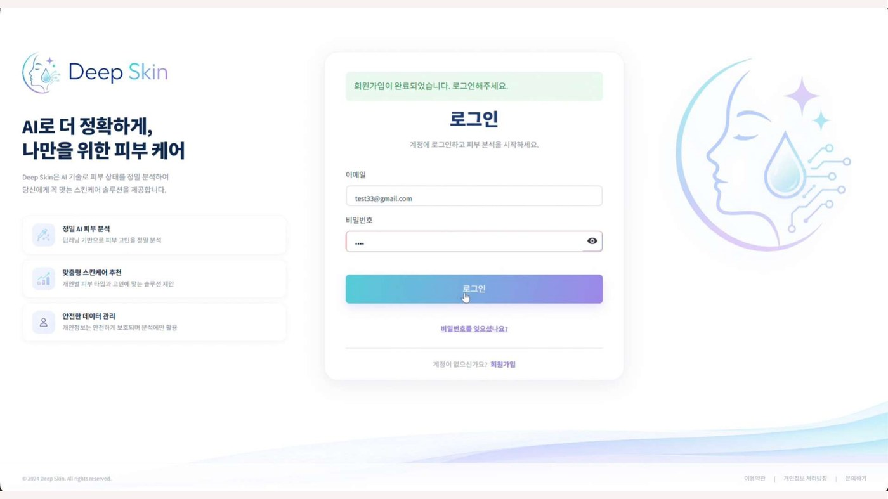
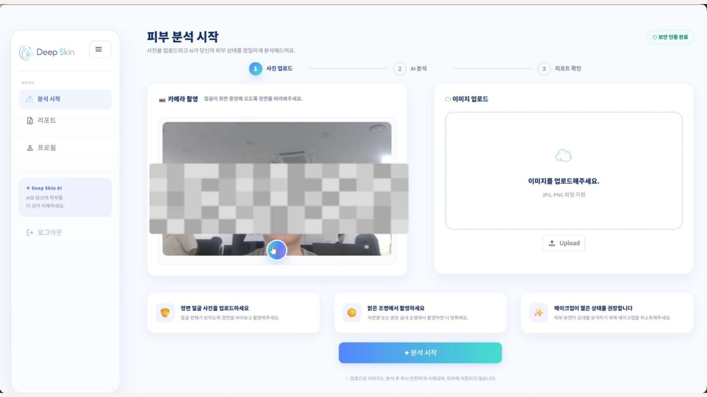
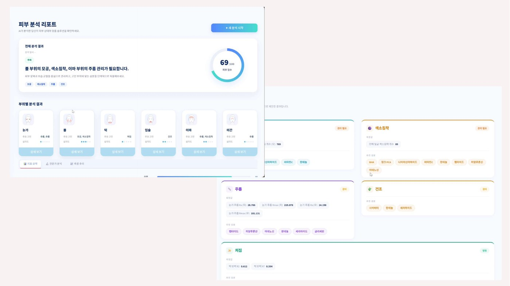
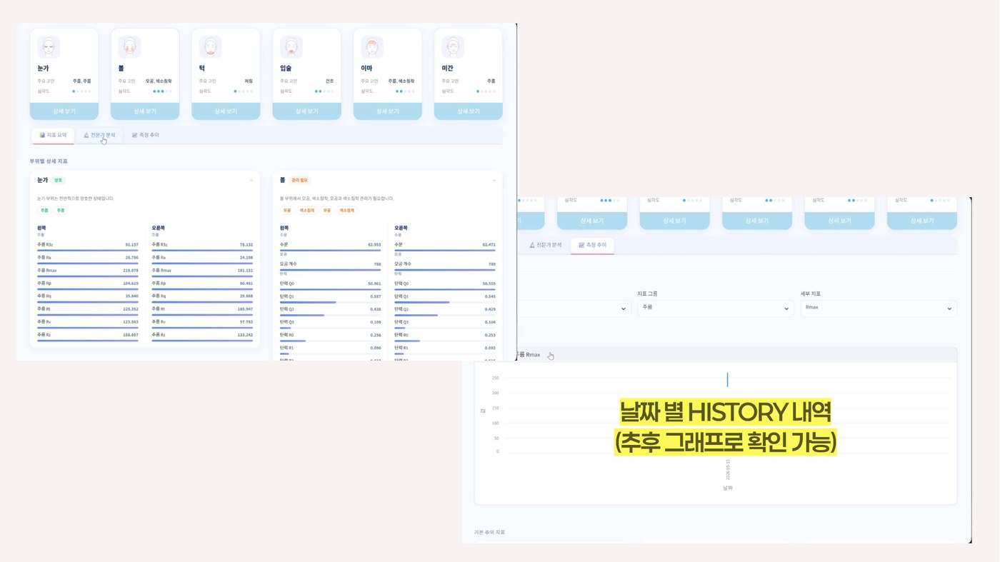
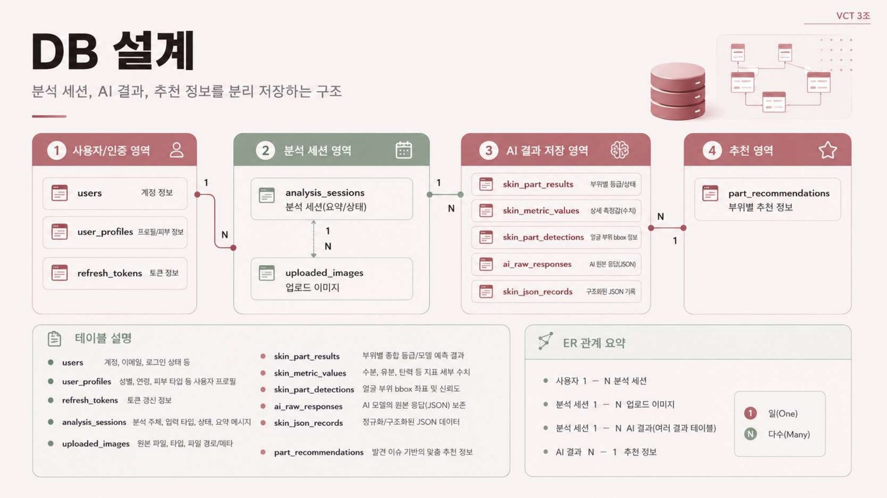

# Deep Skin — AI 피부 분석 · 맞춤 스킨케어 추천

## 데이터 전처리 · 부위별 등급 분류 모델 · AI 추론 연동

> 얼굴 이미지 한 장에서 부위별 피부 상태를 등급으로 정량화하고, 그 결과를 성분 추천까지 연결하는 서비스입니다.
>
> 이 문서는 팀 프로젝트 전체가 아니라 제가 담당한 **데이터 전처리, 등급 분류 모델, AI 추론 연동**을 중심으로 작성했습니다.

---

## 1. 프로젝트 개요

| 항목 | 내용 |
|---|---|
| 프로젝트명 | Deep Skin — 20-40 여성을 위한 맞춤 뷰티 AI Model |
| 진행 기간 | 2026.05.07 ~ 05.15 (팀) · 이후 개인 고도화 |
| 인원 | 4인 팀 프로젝트 |
| 담당 역할 | 부위별 크롭 전처리, 등급 분류 모델 학습·검증, AI 추론 연동(계약·파싱·E2E) |
| 데이터 | AI-Hub 한국인 피부상태 측정 데이터 22.6GB (원천 이미지 + 라벨 JSON 11만 건) |
| 핵심 성과 | 색소침착 QWK **0.640 → 0.736**, 기기 도메인 갭 **63% 축소**, 라벨 오류로 인한 리포트 유실 **4건 수정** |

### 핵심 성과

- 부위·각도별 크롭 파이프라인 구축 — bbox 통계 검증으로 각도 필터를 정정해 **학습 데이터 +48%**
- 6등급 → 3등급 라벨 재정의로 모공 macro-F1 **0.370 → 0.545**, 색소침착 **0.366 → 0.606**
- 파라미터 수를 맞춘 백본 비교(ResNet-50 25.6M → DINOv3 ViT-S/16 21.6M)로 색소침착 QWK **0.640 → 0.736**
- 열화 증강 + DANN으로 디카−스마트폰 성능 격차 **0.097 → 0.036**, 디카 성능은 유지
- 분류 + 회귀 멀티태스크로 장비 측정값 직접 예측(모공 개수 Spearman **0.768**)
- 추론 응답 스키마·파싱·E2E 연동 및 등급 유실 버그 4건, 라벨 문서 오류 8건 수정

---

## 2. 시연 영상

[](https://youtu.be/FYQIVGGnxXY)

> 이미지 업로드 → AI 추론 → 부위별 등급·측정값 리포트 → 성분 추천까지의 흐름입니다.

---

## 3. 문제 정의

### 3.1 라벨 경계가 모호하다

인접 등급의 차이를 사람도 일관되게 구분하기 어렵고, 희소 등급은 표본이 부족합니다. 모공 등급은 6단계인데 등급 2 하나가 전체의 **60.7%** 를 차지합니다.

### 3.2 부위마다 크롭 규격이 다르다

부위별로 가려지는 촬영 각도가 다릅니다. 가려진 부위를 학습에 넣으면 모델은 그 부위가 아닌 것을 그 부위라고 배웁니다. 고정 비율로 자르면 어떤 각도에서는 경계가 잘리고 어떤 각도에서는 배경이 과하게 들어옵니다.

### 3.3 학습 데이터와 서비스 입력의 기기가 다르다

학습 데이터는 디지털카메라 비중이 높은데 **서비스 입력은 스마트폰**입니다. 같은 피부라도 해상도·노이즈·압축이 달라 성능이 떨어집니다.

### 3.4 설계 원칙

- **accuracy가 아니라 macro-F1으로 판단한다** — 조기 종료 기준을 macro-F1으로 고정
- **같은 사람이 train/val에 동시에 들어가지 않는다** — 사람(id) 단위 그룹 분할
- **분류 라벨과 회귀 측정값을 섞지 않는다** — `annotations` / `equipment`를 스키마 단계에서 분리
- **추정한 값을 실측값처럼 내보내지 않는다** — `bbox_source`를 리포트에 노출

---

## 4. 담당 범위와 전체 흐름

```text
AI-Hub 원천 이미지 + 라벨 JSON
  ① 부위별 크롭 전처리   ← 담당   bbox · 각도 필터 · 품질 필터 · 메타데이터 CSV
  ② ID 그룹 분할        ← 담당   같은 사람이 train/val 에 동시에 들어가지 않게
  ③ 등급 분류 모델 학습   ← 담당   ResNet-50 · 불균형 대응 · 3등급 전환 · 한계 진단
       └ (개인 고도화) 각도 필터 검증 · 특징 캐싱 · 백본 비교 · 도메인 적응 · 회귀 확장
  ④ AI 추론 서버 (팀 공동 산출물)   부위 검출 + 멀티태스크 추론
  ⑤ 추론 계약 · 응답 파싱 · E2E   ← 담당
  ⑥ 리포트 · 성분 추천 (FastAPI + Streamlit)   ← 담당
```

담당 부위는 **양쪽 볼(facepart 5·6)** 과 **양쪽 눈가(3·4)**, 예측 대상은 모공·색소침착·주름 등급입니다.



---

## 5. 데이터 전처리 파이프라인

### 5.1 부위별 크롭과 각도 필터

| 부위 | 사용 각도 | 제외 각도 |
|---|---|---|
| 왼쪽 볼·눈가 | 정면 · 위 · 아래 · **R15° · R30°** · 왼쪽 측면 | L15° · L30° |
| 오른쪽 볼·눈가 | 정면 · 위 · 아래 · **L15° · L30°** · 오른쪽 측면 | R15° · R30° |

> 좌/우는 **관찰자(이미지) 기준**입니다 — `왼쪽 볼`은 이미지 왼쪽에 있고, 이는 피사체의 오른쪽 얼굴입니다.
> 이 표는 라벨 10만 건의 bbox 통계로 검증해 한 번 뒤집은 결과입니다(§14.1).

크롭 규칙은 세 가지입니다. 파일명이 아니라 **JSON 내부 `facepart` 값으로 부위를 확정**하고, bbox에 margin을 적용해 주변 맥락을 남기며, 최소 해상도 규칙으로 저품질 크롭을 걸러냅니다. 종횡비는 강제 정사각형 대신 **비율을 보존하는 letterbox 패딩**으로 맞춥니다.

### 5.2 ID 그룹 분할

한 사람당 여러 각도·기기로 촬영된 데이터셋이라 **랜덤 분할은 곧 데이터 누수**입니다. 사람(id) 단위로 묶되, 무작위가 아니라 **희소 클래스 커버리지를 우선하는 그리디 선택**으로 검증셋을 구성했습니다. 사람 단위로만 나누면 희소 등급이 한쪽에 몰려 검증이 불가능해집니다.

### 5.3 분류와 회귀를 섞지 않는다

라벨 JSON에는 **이름이 같고 의미가 다른 두 값**이 있습니다.

| JSON 영역 | 의미 | 학습 유형 | 예시 |
|---|---|---|---|
| `annotations` | 전문가 진단 등급 | Classification | `l_cheek_pore` = 2 (0~5 등급) |
| `equipment` | 장비 측정 수치 | Regression | `l_cheek_pore` = 629.0 (모공 개수) |

혼동한 채 학습하면 결과 전체가 무의미해지므로 코드를 쓰기 전에 문서로 고정했고, 이 구분은 백엔드 DB 설계까지 그대로 이어집니다.

---

## 6. 등급 분류 모델

### 6.1 학습 설계

```text
backbone   ResNet-50 (ImageNet) / DINOv3 ViT-S/16
head       feat_dim → 512 → num_classes
optimizer  AdamW                stop   macro-F1 기준 조기 종료
loss       CE / Focal / CORAL(서수)
```

백본은 freeze / unfreeze를 전환할 수 있게 분리하고, 실험 설정은 코드가 아니라 JSON으로 빼 조건만 바꿔 재현할 수 있게 했습니다.

### 6.2 모델이 아니라 문제 정의를 바꾼다

불균형 보정 3종(Focal · 가중샘플러 · 클래스가중치)은 **전부 실패**했습니다.

| 모공 6등급 · ResNet-50 | 기준선(CE) | Focal | 가중샘플러 | 클래스가중치 |
|---|---:|---:|---:|---:|
| macro-F1 | 0.370 | 0.373 | 0.357 | 0.299 |

성능을 실제로 끌어올린 것은 손실 함수가 아니라 **등급 정의를 6단계에서 3단계로 바꾼 것**입니다. 인접 등급 경계가 모호하고, 서비스가 보여줄 단위도 결국 "양호/보통/주의"이기 때문입니다.

| ResNet-50 | 6등급 | 3등급 |
|---|---:|---:|
| 색소침착 macro-F1 | 0.366 | **0.606** |
| 모공 macro-F1 | 0.370 | **0.545** |

여기서 학습 곡선이 멈췄습니다. EPOCH 11의 best 이후 train/val 간격이 계속 벌어지는 과적합 패턴이라, 하이퍼파라미터를 더 만지는 대신 **백본 자체의 한계**로 진단했습니다.



팀은 이 진단을 근거로 **DINOv3 멀티태스크 구조로 전환**했고, 저는 전환 결정의 근거가 된 한계 진단과 실험 기록을 담당했습니다.

| | ResNet-50 | DINOv3 (팀 전환 결과) |
|---|---|---|
| 사전학습 | 140만 장 · 지도학습 | 17억 장 · 자기지도학습 |
| 백본 처리 | Fine-tuning | Frozen + Caching |
| 처리 부위 | 부위별 개별 모델 | 8개 부위 통합 |



### 6.3 특징 캐싱 실험 환경

개인 고도화 구간은 **CUDA 미지원 노트북**에서 진행했습니다. CPU로 ResNet-50을 전체 미세조정하면 에폭당 1시간을 넘어 조건 비교 자체가 불가능하므로, **백본을 얼리고 특징을 한 번만 뽑아 캐싱**하는 구조를 만들었습니다.

```text
                 1회 (수십 분)                    반복 (수 초)
크롭 이미지 ──► [동결 백본] ──► .npz 특징 캐시 ──► [얕은 head 학습] ──► 지표
                                    └ 손실함수 · 등급 병합 · 샘플러 · 평가 프로토콜을 바꿔 재사용
```

| | 소요 |
|---|---:|
| 특징 추출 (train 15,295장) | 23~47분 |
| **head 학습 1회 (60에폭)** | **5~22초** |

캐싱과 상충하는 증강 대신 **좌우반전 특징을 함께 저장**해 head 학습 시점에 선택하도록 했습니다. 이 구조 덕분에 손실함수·등급 병합 경계·평가 프로토콜을 통제 비교할 수 있었고, 아래 성능 표는 전부 여기서 나왔습니다.

---

## 7. 모델 성능

> 개인 고도화 구간의 수치입니다. 팀 발표 자료의 수치(백본 미세조정 기준)와는 학습 방식·분할·전처리가 달라 직접 비교할 수 없습니다.
> **동일 조건 12회의 시드 표준편차가 0.0074**이므로, 0.02 미만의 차이로는 우열을 판단하지 않았습니다.

### 7.1 백본 비교 — 같은 파라미터 수에서

ResNet-50은 25.6M, DINOv3 ViT-S/16은 21.6M으로 **파라미터는 오히려 DINOv3가 적습니다.** "모델을 키워서 이겼다"가 아니라 사전학습 방식의 차이만 남는 비교가 되도록 골랐습니다.

| 과제 | 백본 | macro-F1 | QWK | 폰 F1 |
|---|---|---:|---:|---:|
| 색소침착 3등급 | ResNet-50 | 0.606 | 0.685 | 0.578 |
| | **DINOv3** | **0.657** | **0.742** | **0.630** |
| 모공 3등급 | ResNet-50 | 0.545 | 0.402 | 0.479 |
| | DINOv3 | 0.563 | 0.436 | 0.499 |
| 색소침착 6등급 | ResNet-50 | 0.366 | 0.640 | 0.273 |
| | **DINOv3 + CORAL** | **0.429** | **0.736** | 0.360 |

주목한 것은 **QWK**입니다. 색소침착 6등급에서 macro-F1은 +0.03인데 QWK는 0.640 → 0.736입니다. QWK는 "몇 등급 차이로 틀렸는가"에 가중치를 주므로, DINOv3 특징이 **맞고 틀림보다 등급의 순서를 훨씬 잘 담고 있다**는 뜻입니다.

서수 손실(CORAL)의 거동이 이 해석을 뒷받침합니다 — ResNet-50 위에서는 6등급 macro-F1을 0.378 → 0.356으로 **떨어뜨리는데**, DINOv3 위에서는 0.400 → 0.429로 **올립니다.** 부호가 반대입니다.

### 7.2 기기 도메인 적응

디카로만 학습해 스마트폰으로만 검증하면 성능이 크게 떨어집니다.

| 디카 학습 → 폰 검증 (3등급) | ResNet-50 | DINOv3 |
|---|---:|---:|
| 모공 macro-F1 | 0.403 | **0.505** |
| 색소침착 macro-F1 | 0.523 | **0.568** |

디카 이미지를 폰 촬영에 가깝게 열화(다운스케일 → 블러 → JPEG 재압축)시킨 특징을 함께 캐싱하고, 여기에 gradient reversal 기반 도메인 적대 학습(DANN)을 더했습니다.

| 모공 3등급 · 전체 검증 (5시드) | 폰 | 디카 | 디카−폰 격차 | 감소 |
|---|---:|---:|---:|---:|
| 기준선 | 0.4672 | 0.5646 | 0.0974 | — |
| 열화 증강 | 0.4795 | — | 0.0797 | 18% |
| DANN λ=1.0 | 0.5067 | — | 0.0612 | 37% |
| **열화 증강 + DANN** | **0.5292** | 0.5655 | **0.0363** | **63%** |

**폰만 끌어올린 것이 아니라 격차 자체가 줄었습니다** — 디카는 0.5646 → 0.5655로 유지됩니다.

> 이 63%는 **세 기기의 라벨이 모두 있는 조건**의 값입니다. 폰 라벨 없이 학습하는 순수 비지도 도메인 적응에서는 이득이 없었습니다(0.517 vs 기준선 0.518). 두 수치를 섞어 쓰면 사실과 다르므로 구분해 기록합니다.

### 7.3 분류 + 회귀 멀티태스크

캐싱된 특징 위에 회귀 헤드를 얹어 **장비 측정값을 직접 예측**하도록 확장했습니다. 특징 재추출 없이 헤드와 손실 함수만 바뀝니다.

| 회귀 타깃 | MAE (원 단위) | R² | Spearman |
|---|---:|---:|---:|
| 볼 모공 개수 | 206.7±8.5 | 0.509±0.035 | **0.768±0.003** |
| 눈가 거칠기 Ra | 3.09±0.02 | 0.531±0.008 | **0.740±0.002** |
| 볼 수분 | 7.75±0.04 | 0.268±0.005 | 0.550±0.002 |

| 5시드 | 분류 단독 | + 회귀(both) | 차이 |
|---|---:|---:|---:|
| 볼 모공 3등급 | 0.5787±0.0028 | 0.5780±0.0073 | −0.0007 |
| 눈가 주름 3등급 | 0.6244±0.0026 | 0.6242±0.0023 | −0.0002 |

전부 시드 산포 안이라 **회귀 기능을 분류 성능 손해 없이 얻습니다.**

---

## 8. 등급 라벨은 무엇을 잃고 있는가

같은 라벨 JSON에 **전문가 등급**과 **장비 측정 수치**가 함께 들어 있다는 점을 이용해, 라벨 품질을 물리량으로 검증했습니다. §3.1에서 "라벨 경계가 모호하다"고 적은 것을 **어디서 어떻게 모호한지** 숫자로 확인한 작업입니다.

전체 Spearman 상관은 0.35~0.48로 "적당히 관련 있다"로 읽힙니다. 그런데 **인접 등급쌍으로 쪼개면 그림이 완전히 달라집니다.**

| 볼 모공 인접 등급쌍 | 0 vs 1 | 1 vs 2 | 2 vs 3 | 3 vs 4 | 4 vs 5 |
|---|---:|---:|---:|---:|---:|
| 측정값으로 가를 확률 | **0.913** | 0.785 | **0.560** | 0.592 | 0.603 |

전문가와 장비는 "모공이 거의 없다 / 조금 있다"까지는 강하게 합의하지만 **그 위로는 거의 무관합니다.** 0.560은 동전 던지기에 가깝고, **하필 그 지점부터 데이터의 61%가 몰려 있습니다.**

이 분석에서 두 가지가 따라 나옵니다.

**등급 병합이 듣는 이유는 물리적 구분 가능성이 아닙니다.** 3등급 병합은 가장 잘 갈리는 경계(0 vs 1, 0.913)를 없애고 거의 무작위인 3~5 경계를 묶습니다. 실제로 측정값과의 상관은 **내려갑니다**(볼 −0.011, 눈가 −0.055). 그런데도 macro-F1은 0.370 → 0.545로 오릅니다. 병합이 듣는 이유는 **클래스 균형**이고, 상관이 내려간 것이 그 증거입니다.

**이미지에는 등급이 담지 못한 정보가 있습니다.** 회귀 헤드로 측정값을 직접 예측하면 Spearman 0.768이 나옵니다(§7.3). 등급 라벨과 측정값의 상관은 0.444입니다. 이미지에는 측정값을 상당히 설명하는 정보가 들어 있는데 **등급 라벨이 그 정보를 많이 잃고 있다**는 뜻입니다.

> 모델의 0.768과 전문가 등급의 0.444를 나란히 놓고 "모델이 전문가보다 정확하다"고 읽으면 안 됩니다. 모델은 그 측정값을 맞히도록 학습됐고 전문가는 애초에 그럴 목적이 아니었습니다.

---

## 9. AI 추론 연동

모델이 잘 나와도 **출력을 서비스가 받아 쓸 수 없으면 의미가 없습니다.** 학습과 서비스 사이를 잇는 구간을 맡았습니다.

### 9.1 추론 계약과 응답 파싱

AI 서버 없이도 백엔드를 개발할 수 있도록 `AI_INFERENCE_MODE`를 mock / remote / multivalue로 분리하고, 응답 스키마를 Pydantic 계약으로 고정했습니다.

응답은 **등급 · 측정값 · 검출 결과를 서로 다른 테이블로 분해**해 저장합니다. §5.3의 분리가 여기까지 이어집니다 — `predicted_value`(모델 예측)와 `measured_value`(장비 측정)를 한 컬럼에 담으면 나중에 구분할 수 없습니다.

### 9.2 등급 → severity 매핑 정본화

리포트의 `severity`는 `normal / mild / moderate / severe` **4개 어휘로 고정**돼 있고, 소비처가 `_SEVERITY_ORDER.get(severity, 0)` 패턴이라 **어휘 밖 값은 최저 등급으로 조용히 강등**됩니다. 라벨마다 등급 상한이 다른 것을 파서의 라벨별 테이블에서 정규화하고, 추론 엔진이 이 정본을 호출하도록 위임했습니다(§14.3).

### 9.3 추정값을 추정값이라고 표시하기

부위 검출에 실패하면 전체 이미지로 fallback해 추론합니다. 그 값이 다른 부위와 똑같은 모양으로 리포트에 실리면 **사용자는 추정값을 실측값으로 읽습니다.**

`bbox_source`(`yolo` / `full_image_fallback`)를 API 스키마와 프론트엔드까지 노출하고, 좌·우를 묶는 화면 항목에는 `mixed` 상태를 따로 두었습니다. **값 자체는 숨기지 않았습니다** — 항목이 사라지면 사용자는 이유를 알 수 없습니다.

두 번째 방어선은 업로드 시점의 정면 판정입니다. **추가 모델 없이** 검출 결과만으로 판정할 수 있고, 데이터셋에 정답 각도가 붙어 있으므로 **임계값을 실측으로** 정했습니다(각도당 30장, 270장).

| 지표 | 정확도 | 오탐 | 미탐 |
|---|---:|---:|---:|
| 눈가 쌍이 모두 검출되는가 | 62.2% | 102 | 0 |
| **미간이 두 볼 중점에서 벗어난 정도** (임계 0.05) | **94.8%** | **0** | 14 |
| 같은 지표, 임계 0.06 | 95.6% | 5 | 7 |

정확도가 더 높은 0.06 대신 **0.05를 택했습니다.** 오탐은 "측면 사진을 정면으로 통과시켜 추정값을 실측값처럼 내보내는" 실패이고, 미탐은 "재촬영을 한 번 더 권하는" 실패입니다. **정확도는 같은 단위로 세지만 비용은 대칭이 아닙니다.**

---

## 10. 주요 화면

| 로그인 | 이미지 업로드 |
|:---:|:---:|
|  |  |

| 분석 리포트 — 부위별 등급 · 측정값 · 추천 성분 |
|:---:|
|  |

| 분석 이력 | 부위 검출 결과 |
|:---:|:---:|
|  |  |

> 리포트 화면의 부위별 카드에 붙는 `관리 필요 / 경미 / 양호` 라벨이 §9.2의 severity 매핑 결과이고,
> `눈가 주름 Ra 28.786` 같은 값이 §5.3에서 분리한 `equipment` 측정값입니다.

| YOLO 학습 지표 | 부위 혼동행렬 |
|:---:|:---:|
|  |  |

---

## 11. 기술 스택

| 분류 | 기술 |
|---|---|
| AI · 학습 | Python 3.12, PyTorch, torchvision, timm(DINOv3), scikit-learn, Pandas |
| Backend | FastAPI, SQLAlchemy, Alembic, MySQL 8, Pydantic v2 |
| Frontend | Streamlit |
| 개발 환경 | uv, Docker, Git |

---

## 12. 프로젝트 구조

```text
notebooks/jh/
├── crop.py                  # 부위별 크롭 · 각도 필터 · 메타데이터 CSV
├── extract_features.py      # 동결 백본 특징 추출 · 열화 증강 · 좌우반전 캐싱
├── train_head.py            # head 학습 · CORAL · DANN · 회귀 멀티태스크
├── report_tables.py         # README 실험 표를 로그에서 재생성
├── facepart_audit.py        # 부위·각도별 bbox 기하 통계
├── equipment_audit.py       # 장비 측정값 키·결측률 감사
└── calibration.py           # 예측 확률 신뢰도 측정

backend/
├── app/services/
│   ├── multivalue_parser.py # 추론 응답 → 4개 테이블 분해
│   ├── severity_scale.py    # 등급 → severity 정본 매핑
│   └── recommendation_service.py
├── scripts/
│   ├── face_detector.py     # 부위 검출 · 좌우 재할당
│   ├── inference_engine.py  # 추론 엔진
│   └── pose_check.py        # 정면 판정
└── tests/

frontend/                    # Streamlit — 업로드 · 리포트 · 추천 화면
docs/                        # 라벨 코드값 · 크롭 규격 · 학습 전제
```

추론 응답을 등급·측정값·검출 결과로 분해해 저장하는 스키마입니다(§9.1).



---

## 13. 실행 방법

> AI-Hub 원본 데이터(22.6GB)와 `.env`, MySQL이 필요합니다. 저장소에 포함되어 있지 않습니다.

```bash
uv sync

# 크롭 → 특징 캐싱 → head 학습 실험
uv run python notebooks/jh/crop.py --faceparts 5 6
uv run python notebooks/jh/extract_features.py --split train --arch dinov3_s
uv run python notebooks/jh/train_head.py --target pore --grades 3

# 분류 + 회귀 멀티태스크
uv run python notebooks/jh/train_head.py --target pore --grades 3 \
    --reg-target cheek_pore --task both

# README 실험 표를 로그에서 재생성해 대조
uv run python notebooks/jh/report_tables.py --check
```

### 백엔드 테스트

```bash
cd backend && uv run pytest
```

---

## 14. 트러블슈팅

### 14.1 각도 필터가 가장 선명한 크롭을 버리고 있었다

**문제**

크롭 결과를 부위·각도별로 샘플링해 대조 시트를 만들었더니, 학습에 들어가는 크롭이 예상과 정반대였습니다. **각도 코드는 "얼굴이 도는 방향" 기준이지 "어느 쪽이 보이는가" 기준이 아니었습니다.** 얼굴이 오른쪽으로 돌면 카메라 정면으로 오는 것은 왼쪽 볼인데, 필터가 이를 반대로 읽어 가장 선명한 각도를 버리고 가장 납작한 각도를 학습에 넣고 있었습니다.

**해결**

라벨 JSON 100,386건의 bbox 기하 통계로 확인했습니다. 아래는 왼쪽 볼 크롭의 가로/세로 비 중앙값으로, 클수록 부위가 정면으로 온 것입니다.

| 각도 | 5 (R15°) | 6 (R30°) | 8 (측면) | 3 (L15°) | 4 (L30°) |
|---|---:|---:|---:|---:|---:|
| 가로/세로 비 | **1.16** | **1.39** | **1.32** | 0.52 | 0.44 |
| 기존 필터 | 제외 | 제외 | 제외 | 사용 | 사용 |

필터를 뒤집고, 품질 임계값도 감이 아니라 **15,444개 샘플의 백분위**에서 산출했습니다.

**결과**

| | 수정 전 | 수정 후 |
|---|---:|---:|
| train 크롭 | 10,300여 장 | **15,295장 (+48%)** |
| 스마트폰·패드 비중 | 33% | **44%** |
| 크롭 오류 | — | **0건** |

데이터가 1.5배로 늘었을 뿐 아니라 **서비스 입력과 같은 기기의 비중**이 올랐습니다. 학습을 아무리 돌려도 지표로는 드러나지 않는 오류였습니다.

---

### 14.2 "한쪽 눈가가 측정되지 않는다" — 검출기는 정상이었다

**문제**

서비스에서 한쪽 눈가가 측정되지 않는 현상이 보고됐습니다.

**해결**

원인을 세 가지로 좁혀 라벨 108,070건을 전수 집계했는데 **셋 다 거짓**이었습니다.

| 가설 | 결과 |
|---|---|
| 좌/우 정의가 코드와 라벨에서 어긋난다 | **거짓** — 눈가·볼이 같은 규약 |
| 스마트폰 셀피 미러링으로 좌우가 뒤집힌다 | **거짓** — 세 기기 모두 같은 쪽 |
| 눈가 각도 필터가 볼과 같은 오류를 갖는다 | **해당 없음** — 눈가 필터가 아직 없었음 |

검출기도 정상이었습니다 — 혼동행렬에서 `l_eye` ↔ `r_eye` 오분류가 **0건**이고 mAP50 0.994입니다.

**진짜 원인은 데이터셋 구조였습니다.** 정답 수가 이마·입술·턱 1,391건, 볼 1,388건인데 **눈가만 1,124 / 1,144로 18% 적습니다.** 비정면 사진에서 가려진 쪽 눈가에는 데이터셋이 애초에 라벨을 붙이지 않았고, 검출기는 그대로 학습해 그대로 동작하고 있었습니다.

**결과**

검출을 고치는 문제가 아니라 **그 다음을 설계하는 문제**로 재정의했습니다 — `bbox_source` 노출과 업로드 시점 정면 판정(§9.3)이 여기서 나왔습니다. **조용히 틀린 값을 내보내는 것이 검출 실패보다 나쁩니다.**

---

### 14.3 가장 심한 등급이 리포트에서 통째로 사라지고 있었다

**문제**

severity 매핑이 라벨 문서의 등급 상한을 근거로 만들어졌는데, 문서의 상한이 실제보다 낮았습니다. 상한을 넘는 등급은 `None`이 되어 **리포트 항목 자체가 사라지고**, 로그에 경고만 남고 사용자 화면에는 아무 표시가 없습니다.

**해결**

라벨 JSON 112,905건을 전수 집계해 실제 등급 범위를 확인했습니다.

| 라벨 | 매핑 상한 | 실제 상한 | 유실 | 유실률 |
|---|---:|---:|---:|---:|
| `glabellus_wrinkle` (미간) | 0~2 | **0~6** | 3,003건 | **23.94%** |
| `forehead_wrinkle` | 0~4 | **0~6** | 1,352건 | 10.78% |
| `forehead_pigmentation` | 0~3 | **0~5** | 143건 | 1.14% |
| `chin_sagging` | 0~5 | **0~6** | 13건 | 0.10% |

어휘를 넓히지 않은 것이 핵심입니다. `"extreme"`을 추가하는 편이 직관적으로 보이지만, 소비처가 `.get(x, 0)` 패턴이라 **어휘 밖 값은 최고 등급이 정렬에서 최하위가 됩니다.** 등급 수가 같은 라벨은 기존 정규화 테이블을 재사용하고, 추론 엔진의 중복 테이블은 제거해 파서 정본을 호출하도록 위임했습니다.

**결과**

부위 레코드 137,995건 중 **4,511건(3.27%)** 이 리포트에서 복구됐습니다. 미간 주름은 네 번 중 한 번꼴로 사라지고 있었습니다.

값을 단언하는 대신 **`0..실측상한` 전 등급이 매핑에 덮여 있는지** 검사하는 테스트를 추가해, 라벨이 늘어날 때 누락이 자동으로 걸리도록 했습니다.

---

### 14.4 라벨 문서를 믿을 수 없다

**문제**

위 세 건이 모두 문서와 실제의 불일치에서 나왔습니다. 코드로는 드러나지 않고 데이터를 세어야만 보이는 종류입니다.

**해결**

라벨 문서 전체를 실측과 대조했습니다.

| 항목 | 문서 | 실제 | 확인 방법 |
|---|---|---|---|
| bbox 형식 | `[x, y, w, h]` | **`[x1, y1, x2, y2]`** | 문서대로 읽으면 71.2%가 이미지 경계를 벗어남 |
| 패드·폰 각도 | 0~8 | **0·7·8 세 개만** | 각도 1~6의 패드·폰 레코드 0건 |
| 눈가 거칠기 키 | `wrinkle_{l,r}_eye_Ra` | **`{l,r}_perocular_wrinkle_Ra`** | 실제 JSON 키를 전수 집계 |
| 등급 상한 5건 | 전부 낮게 | **최대 0~6** | 라벨 JSON 112,905건 전수 집계 |

**결과**

오류 **8건**을 문서에 반영했고, 이후 모든 작업을 문서가 아니라 **실측 집계에서 시작**하도록 순서를 바꿨습니다.

---

### 14.5 실험이 빨라지자 생긴 새로운 오류

**문제**

head 학습이 수 초로 끝나 조건을 수십 개 비교할 수 있게 되자, **각 수치가 시드 운을 얼마나 타는지 재지 않은 채** 비교표를 쌓고 있었습니다.

**해결**

동일 조건 12회를 돌려 표준편차를 측정했습니다 — **0.0074**(범위 0.5632~0.5870). 동일 시드 2회는 완전히 같은 값을 내므로 재현성 문제가 아니라 순수한 초기화·샘플링 민감도입니다.

**결과**

**0.02 미만 차이로는 우열을 주장하지 않는다**는 기준을 세우고, 그에 따라 이미 써 둔 결론 하나("모공 3등급에서 CORAL이 CE보다 낫다", 차이 0.006)를 **철회**했습니다.

실험 로그(`results/head_experiments.csv`)에 조건·지표·기기별 성능·시드를 실행마다 누적하고, **README의 실험 표를 로그에서 자동 생성**하도록 만들었습니다.

```bash
uv run python notebooks/jh/report_tables.py --check
```

출력이 README와 다르면 둘 중 하나가 틀린 것입니다.

---

## 15. 회고

**성능이 안 나올 때 어디를 먼저 봐야 하는가**를 배웠습니다. 처음에는 하이퍼파라미터와 증강을 만졌지만 실제로 성능을 끌어올린 것은 등급 정의를 바꾼 것이었고, 그 전에 기준 지표를 accuracy에서 macro-F1으로 바꾸지 않았다면 개선인지 악화인지도 몰랐을 것입니다.

**모델을 의심하기 전에 데이터를, 데이터를 의심하기 전에 내가 쓴 필터를** 봐야 한다는 것도 이때 익혔습니다. 각도 코드를 반대로 읽어 가장 선명한 크롭을 버리고 있었는데, 학습을 아무리 돌려도 지표로는 드러나지 않는 오류였습니다. 대조 시트를 보고 "letterbox 패딩이 없다"고 판단했다가 `dataset.py`에 이미 들어 있는 것을 확인한 일도 있었습니다 — 문제를 발견했다고 생각했을 때 먼저 기존 코드를 다시 읽는 순서가 여기서 생겼습니다.

**라벨은 데이터로 검증할 수 있습니다.** §3.1에 "라벨 경계가 모호하다"고 적었지만 그건 전제였습니다. 같은 JSON의 장비 측정값과 대조해 보고서야 어느 등급 경계에서 어떻게 무너지는지가 보였고, 등급 병합이 잘 들었던 이유도 다시 읽혔습니다 — 물리적으로 구분 가능한 단위로 묶여서가 아니라 클래스 균형 때문이었습니다. **문제 정의를 문장으로 쓰는 것과 숫자로 확인하는 것은 다른 일**이었습니다.

**재보고 안 쓰기로 하는 것도 결과입니다.** 모델이 예측 확률로 "확신하지 못한다"고 말하고 있는 것을 발견했을 때는 바로 화면에 내보낼 생각이었는데, 그 확률이 오답을 실제로 가르는지 재보니 네 조건 중 하나뿐이었습니다(AUC 0.59~0.60, 눈가 주름 3등급만 0.765). 그 한 곳에만 임계값을 걸고 나머지는 두었습니다. **정직한 신호와 쓸모 있는 신호는 다른 것**이었습니다.

---

## 16. 고도화 방향

### Phase 1. 나머지 부위 확장

`crop.py`는 부위 테이블 기반으로 일반화했으나 이마·미간·입술·턱은 아직 학습하지 않았습니다. 실측 등급 수가 5·6·7단계로 갈리므로 부위별 헤드 구성이 필요합니다. 확장하면 §8의 등급↔측정값 대조를 수분·탄력 지표로도 수행할 수 있습니다.

### Phase 2. 서비스가 제공하지 못하는 지표 복구

`chin_moisture`·`forehead_moisture`는 원본 라벨에 100% 존재하지만 학습 대상에 넣지 않아 서비스가 내보내지 못합니다. §7.3의 회귀 헤드로 낼 수 있는 값입니다. 다만 볼 수분의 R²가 0.268로 약했으므로 **사진으로 읽을 수 있는 지표와 없는 지표를 먼저 가려야** 합니다.

### Phase 3. 라벨 없는 신규 기기 대응

열화 증강과 DANN 모두 **폰 라벨이 있는 조건에서만** 효과가 있었습니다(§7.2). 라벨 없는 새 기기가 들어오는 상황에는 지금의 결과가 근거가 되지 않으며, 남은 것은 모델이 아니라 **데이터 확보**로 보입니다.

### Phase 4. 백본 스케일업

DINOv3 ViT-B/16은 CPU로 특징 추출에 2시간 이상 걸려 보류했습니다. GPU 환경에서는 §7.1의 파라미터 매칭 비교를 한 단계 위에서 반복할 수 있습니다.
